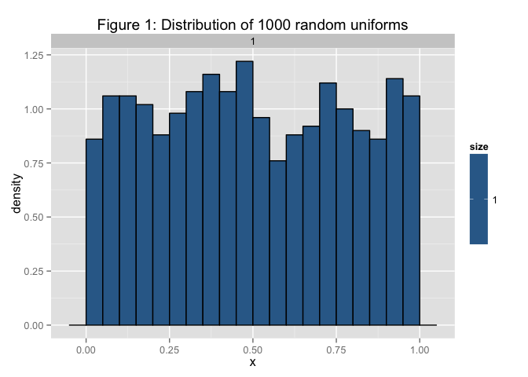
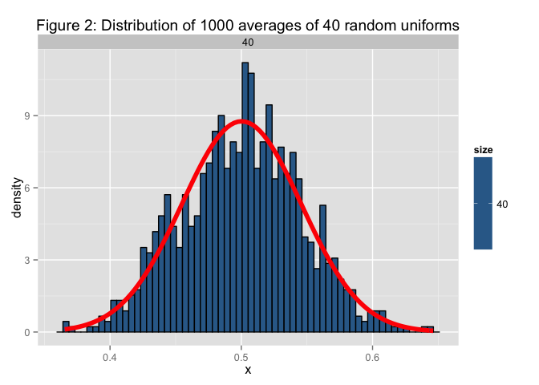
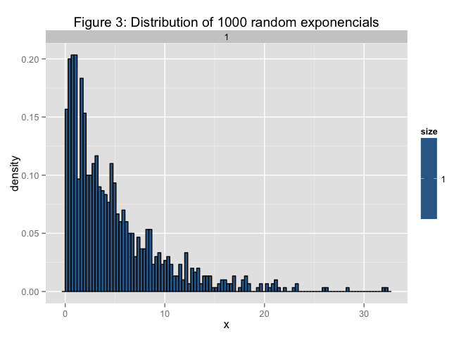
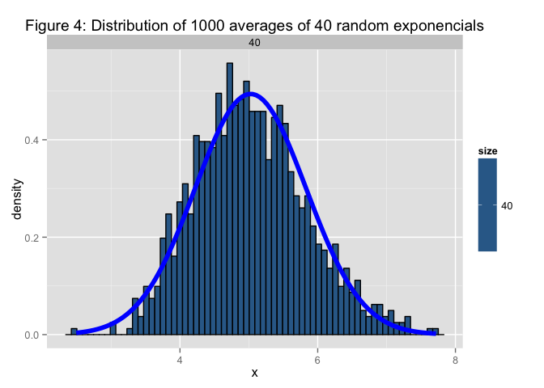

# Central Limit Theorem (Statistical Inference Course Project Part 1)
by José Carrasquero

##Overview
The objective is to investigate the exponential distribution in R and compare it with the Central Limit Theorem. The exponential distribution can be simulated in R with rexp(n, lambda) where lambda is the rate parameter. lambda will be set to 0.2 for all of the simulations. Thw distribution of averages of 40 exponentials will be examined.  

The following packages are used for this analysis:


```r
library(ggplot2)
```

##Simulations 
Four distinct simulations where used (2 for uniform and 2 for exponentional distributions). The idea is to demostrate that the central limit theorom is valid for both distributions.

####1. Distribution of 1000 random uniforms: 
Following R code is used to obtain 1000 numbers from a uniform distribution. Then it is transform from numeric to data frame in order to use ggplot to generate relevant graph. The graph generated with this code can be seen in Figure 1 of the appendix.


```r
set.seed(1)
x = NULL
x <- runif(1000)
dat <- as.data.frame(x)
dat$size<-1
```

####2. Distribution of 1000 averages of 40 random uniforms: 
Following R code is used to obtain 1000 averages from a 40 random uniform distributions. Then it is transform from numeric to data frame in order to use ggplot to generate relevant graph. The graph generated with this code can be seen in Figure 1 of the appendix.


```r
set.seed(2)
x = NULL
for (i in 1 : 1000) x = c(x, mean(runif(40)))
dat <- as.data.frame(x)
dat$size<-40
```

####3. Distribution of 1000 random exponencials: 
Following R code is used to obtain 1000 numbers from a exponential distribution with a lambda rate parameter equal to 0.2. Then it is transform from numeric to data frame in order to use ggplot to generate relevant graph. The graph generated with this code can be seen in Figure 1 of the appendix.


```r
set.seed(3)
lambda = 0.2 
x = NULL
x <- rexp(1000,lambda)
dat <- as.data.frame(x)
dat$size<-1
```

####4. Distribution of 1000 averages of 40 random exponencials: 
Following R code is used to obtain 1000 averages from a 40 random exponencial distributions with a lambda rate parameter equal to 0.2. Then it is transform from numeric to data frame in order to use ggplot to generate relevant graph. The graph generated with this code can be seen in Figure 1 of the appendix.


```r
set.seed(4)
lambda = 0.2 
x = NULL
for (i in 1 : 1000) x = c(x, mean(rexp(40,lambda)))
dat <- as.data.frame(x)
dat$size<-40
```

##Sample Mean versus Theoretical Mean
Figure 4 of the appendix can be referenced to see the Distribution of 1000 averages of 40 random exponencials. In this figure we can see that the normal distribution has a mean of around 5. The theorical value of the mean is 1/lambda.


```r
sample_mean = mean(dat$x)
sample_mean
```

```
## [1] 5.025289
```

```r
theoretical_mean = 1/lambda
theoretical_mean
```

```
## [1] 5
```

From these simulations we can see that the theoretical value of the mean is 5 and the value of the sample mean is 5.0252889. If we increase the number of simulation (for example from 1000 to 100000) the sample and theoretical means should be closer together.

##Sample Variance versus Theoretical Variance
Figure 4 of the appendix can be referenced to see the Distribution of 1000 averages of 40 random exponencials. The theorical value of the varience is (1/lambda)/(sqrt(40))^2.


```r
sample_sd = sd(dat$x)
sample_sd
```

```
## [1] 0.8074277
```

```r
theoretical_sd = (1/lambda)/(sqrt(40))
theoretical_sd
```

```
## [1] 0.7905694
```

```r
sample_varience = sample_sd^2
sample_varience
```

```
## [1] 0.6519395
```

```r
theoretical_varience = theoretical_sd^2
theoretical_varience
```

```
## [1] 0.625
```

From these simulations we can see that the theoretical value of the varience is 0.625 and the value of the sample mean is 0.6519395. If we increase the number of simulation (for example from 1000 to 100000) the sample and theoretical variences should be closer together.

##Distribution: 
In order to demonstrate that the distribution is approximately normal, a normal distribution with mean 5.0252889 (equivalent to the mean of the sample) and 0.8074277 (equivalent to the standard deviation of the sample) was overlaid on the distribution of 1000 averages of 40 random exponentials. This can be seen in figure 4 of the appendix. It can be appreciated that the bars of the histogram fit within the normal distribution and with this we are able to demonstrate that the distribution is approximately normal.

As it can be observed in Figures 2 and 4 of the appendix, the Central Limit Theorom is valid for both type of distributions.

##Appendix 1:

This appendix section contains all the figures that are referenced through out the document and the complete code that was used to generate them in each case.


```r
# Distribution of 1000 random uniforms
set.seed(1)
x = NULL
x <- runif(1000)
dat <- as.data.frame(x)
dat$size<-1
g <- ggplot(dat, aes(x = x, fill = size)) + geom_histogram(binwidth=.05, colour = "black", aes(y = ..density..)) 
g <- g + ggtitle("Figure 1: Distribution of 1000 random uniforms")
g + facet_grid(. ~ size)
```

 

```r
# Distribution of 1000 averages of 40 random uniforms
set.seed(2)
x = NULL
for (i in 1 : 1000) x = c(x, mean(runif(40)))
dat <- as.data.frame(x)
dat$size<-40
g <- ggplot(dat, aes(x = x, fill = size)) + geom_histogram(binwidth=sd(dat$x)/10, colour = "black", aes(y = ..density..)) 
g <- g + stat_function(fun = dnorm, arg = list(mean = mean(dat$x), sd = sd(dat$x)), size=2, col="red")
g <- g + ggtitle("Figure 2: Distribution of 1000 averages of 40 random uniforms")
g + facet_grid(. ~ size)
```

 

```r
# Distribution of 1000 random exponencials"
set.seed(3)
lambda = 0.2 
x = NULL
x <- rexp(1000,lambda)
dat <- as.data.frame(x)
dat$size<-1
g <- ggplot(dat, aes(x = x, fill = size)) + geom_histogram(binwidth=.3, colour = "black", aes(y = ..density..)) 
g <- g + ggtitle("Figure 3: Distribution of 1000 random exponencials")
g + facet_grid(. ~ size)
```

 

```r
# Distribution of 1000 averages of 40 random exponencials
set.seed(4)
lambda = 0.2 
x = NULL
for (i in 1 : 1000) x = c(x, mean(rexp(40,lambda)))
dat <- as.data.frame(x)
dat$size<-40
g <- ggplot(dat, aes(x = x, fill = size)) + geom_histogram(binwidth=sd(dat$x)/10, colour = "black", aes(y = ..density..)) 
g <- g + stat_function(fun = dnorm, arg = list(mean = mean(dat$x), sd = sd(dat$x)), size=2, col="blue") 
g <- g + ggtitle("Figure 4: Distribution of 1000 averages of 40 random exponencials")
g + facet_grid(. ~ size)
```

 
