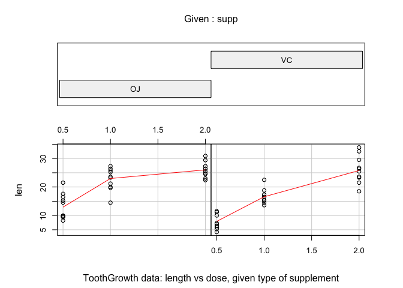
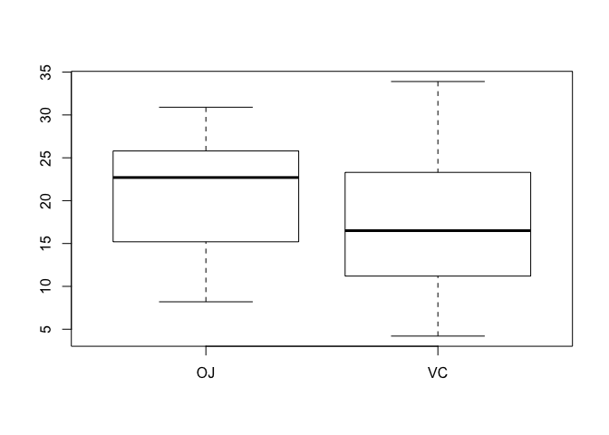
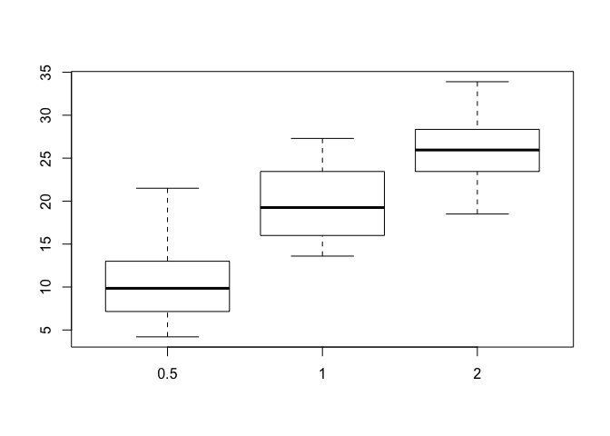

# Tooth Growth Data (Statistical Inference Course Project Part 2)
by José Carrasquero

##1. Load the ToothGrowth data and perform some basic exploratory data analyses 
The following packages are used for this analysis:


```r
library(graphics)
library(datasets)
```


```r
require(graphics)
coplot(len ~ dose | supp, data = ToothGrowth, panel = panel.smooth,
       xlab = "ToothGrowth data: length vs dose, given type of supplement")
```

 

```r
##Box len ~ supp
boxplot(len ~ supp, ToothGrowth)
```

 

```r
##Box len ~ dose
boxplot(len ~ dose, ToothGrowth)
```

 


##2. Provide a basic summary of the data.

```r
print(ToothGrowth)
```

```
##     len supp dose
## 1   4.2   VC  0.5
## 2  11.5   VC  0.5
## 3   7.3   VC  0.5
## 4   5.8   VC  0.5
## 5   6.4   VC  0.5
## 6  10.0   VC  0.5
## 7  11.2   VC  0.5
## 8  11.2   VC  0.5
## 9   5.2   VC  0.5
## 10  7.0   VC  0.5
## 11 16.5   VC  1.0
## 12 16.5   VC  1.0
## 13 15.2   VC  1.0
## 14 17.3   VC  1.0
## 15 22.5   VC  1.0
## 16 17.3   VC  1.0
## 17 13.6   VC  1.0
## 18 14.5   VC  1.0
## 19 18.8   VC  1.0
## 20 15.5   VC  1.0
## 21 23.6   VC  2.0
## 22 18.5   VC  2.0
## 23 33.9   VC  2.0
## 24 25.5   VC  2.0
## 25 26.4   VC  2.0
## 26 32.5   VC  2.0
## 27 26.7   VC  2.0
## 28 21.5   VC  2.0
## 29 23.3   VC  2.0
## 30 29.5   VC  2.0
## 31 15.2   OJ  0.5
## 32 21.5   OJ  0.5
## 33 17.6   OJ  0.5
## 34  9.7   OJ  0.5
## 35 14.5   OJ  0.5
## 36 10.0   OJ  0.5
## 37  8.2   OJ  0.5
## 38  9.4   OJ  0.5
## 39 16.5   OJ  0.5
## 40  9.7   OJ  0.5
## 41 19.7   OJ  1.0
## 42 23.3   OJ  1.0
## 43 23.6   OJ  1.0
## 44 26.4   OJ  1.0
## 45 20.0   OJ  1.0
## 46 25.2   OJ  1.0
## 47 25.8   OJ  1.0
## 48 21.2   OJ  1.0
## 49 14.5   OJ  1.0
## 50 27.3   OJ  1.0
## 51 25.5   OJ  2.0
## 52 26.4   OJ  2.0
## 53 22.4   OJ  2.0
## 54 24.5   OJ  2.0
## 55 24.8   OJ  2.0
## 56 30.9   OJ  2.0
## 57 26.4   OJ  2.0
## 58 27.3   OJ  2.0
## 59 29.4   OJ  2.0
## 60 23.0   OJ  2.0
```

```r
summary(ToothGrowth)
```

```
##       len        supp         dose      
##  Min.   : 4.20   OJ:30   Min.   :0.500  
##  1st Qu.:13.07   VC:30   1st Qu.:0.500  
##  Median :19.25           Median :1.000  
##  Mean   :18.81           Mean   :1.167  
##  3rd Qu.:25.27           3rd Qu.:2.000  
##  Max.   :33.90           Max.   :2.000
```

```r
#Different doses
unique(ToothGrowth$dose)
```

```
## [1] 0.5 1.0 2.0
```

##3. Use confidence intervals and/or hypothesis tests to compare tooth growth by supp and dose. (Only use the techniques from class, even if there's other approaches worth considering)


```r
t.test(len ~ supp, ToothGrowth, paired = FALSE, var.equal = FALSE, conf.level = 0.95)
```

```
## 
## 	Welch Two Sample t-test
## 
## data:  len by supp
## t = 1.9153, df = 55.309, p-value = 0.06063
## alternative hypothesis: true difference in means is not equal to 0
## 95 percent confidence interval:
##  -0.1710156  7.5710156
## sample estimates:
## mean in group OJ mean in group VC 
##         20.66333         16.96333
```

```r
t.test(len ~ supp, ToothGrowth[ToothGrowth$dose == 0.5, ], paired = FALSE, var.equal = FALSE, conf.level = 0.95)
```

```
## 
## 	Welch Two Sample t-test
## 
## data:  len by supp
## t = 3.1697, df = 14.969, p-value = 0.006359
## alternative hypothesis: true difference in means is not equal to 0
## 95 percent confidence interval:
##  1.719057 8.780943
## sample estimates:
## mean in group OJ mean in group VC 
##            13.23             7.98
```

```r
t.test(len ~ supp, ToothGrowth[ToothGrowth$dose == 1, ],paired = FALSE, var.equal = FALSE, conf.level = 0.95)
```

```
## 
## 	Welch Two Sample t-test
## 
## data:  len by supp
## t = 4.0328, df = 15.358, p-value = 0.001038
## alternative hypothesis: true difference in means is not equal to 0
## 95 percent confidence interval:
##  2.802148 9.057852
## sample estimates:
## mean in group OJ mean in group VC 
##            22.70            16.77
```

```r
t.test(len ~ supp, ToothGrowth[ToothGrowth$dose == 2, ],paired = FALSE, var.equal = FALSE, conf.level = 0.95)
```

```
## 
## 	Welch Two Sample t-test
## 
## data:  len by supp
## t = -0.046136, df = 14.04, p-value = 0.9639
## alternative hypothesis: true difference in means is not equal to 0
## 95 percent confidence interval:
##  -3.79807  3.63807
## sample estimates:
## mean in group OJ mean in group VC 
##            26.06            26.14
```

```r
t.test(len ~ dose, ToothGrowth[ToothGrowth$dose != 2, ], paired = FALSE, var.equal = FALSE, conf.level = 0.95)
```

```
## 
## 	Welch Two Sample t-test
## 
## data:  len by dose
## t = -6.4766, df = 37.986, p-value = 1.268e-07
## alternative hypothesis: true difference in means is not equal to 0
## 95 percent confidence interval:
##  -11.983781  -6.276219
## sample estimates:
## mean in group 0.5   mean in group 1 
##            10.605            19.735
```

```r
t.test(len ~ dose, ToothGrowth[ToothGrowth$dose != 1, ], paired = FALSE, var.equal = FALSE, conf.level = 0.95)
```

```
## 
## 	Welch Two Sample t-test
## 
## data:  len by dose
## t = -11.799, df = 36.883, p-value = 4.398e-14
## alternative hypothesis: true difference in means is not equal to 0
## 95 percent confidence interval:
##  -18.15617 -12.83383
## sample estimates:
## mean in group 0.5   mean in group 2 
##            10.605            26.100
```

```r
t.test(len ~ dose, ToothGrowth[ToothGrowth$dose != 0.5, ], paired = FALSE, var.equal = FALSE, conf.level = 0.95)
```

```
## 
## 	Welch Two Sample t-test
## 
## data:  len by dose
## t = -4.9005, df = 37.101, p-value = 1.906e-05
## alternative hypothesis: true difference in means is not equal to 0
## 95 percent confidence interval:
##  -8.996481 -3.733519
## sample estimates:
## mean in group 1 mean in group 2 
##          19.735          26.100
```

##4. State your conclusions and the assumptions needed for your conclusions. 

Assumptions:

1. The Data is not Paired. It is a Two Sample T Test.

2. From the box plots we can assume the variences are not equal.

Conclusion:
1. Suplement type has no effect on tooth growth. (this is seen in the first 3 T test)
2. The dose level does have an effect on tooth growth. (this can be seen in the last 3 t test)
